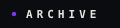
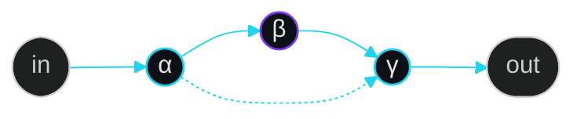
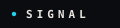

<!--
  ╔══════════════════════════════════════════════════════════════════════════════╗
  ║  BenjaminSRussell · data-plane · craft v1.2.0                ║
  ║  seed: EC8AC918  ← SHA-256("BenjaminSRussell")[:8]           ║
  ║  tokens: void / violet#7C3AED / cyan#22D3EE / mist / bone    ║
  ║  principles: beauty · whitespace · show don't tell           ║
  ║  signature: BSR⋄DP⋄1.2.0[^v]                                 ║
  ╚══════════════════════════════════════════════════════════════════════════════╝
-->

<!-- 1 · HERO -->

  

<!-- 2 · typing (sigil lives quietly in footer — no competition) -->

   

<!-- 4 · one live stats pair — breathing room, ~46% each -->
<table align="center" width="880" border="0" cellspacing="0" cellpadding="12">
  <tr>
    <td width="46%" align="center" valign="top">
      
    </td>
    <td width="8%"></td>
    <td width="46%" align="center" valign="top">
      
    </td>
  </tr>
</table>

  

<!-- 5 · flow divider -->

  

<!-- 6 · constellation — custom stage -->

 

  

<!-- featured orbit — 2 cards only -->
<table align="center" width="880" border="0" cellspacing="0" cellpadding="14">
  <tr>
    <td width="46%" align="center" valign="top">
      
    </td>
    <td width="8%"></td>
    <td width="46%" align="center" valign="top">
      
    </td>
  </tr>
</table>

  

<!-- 7 · MOTION — snake alone -->

  

  

   

<!-- ═══════════════════════════════════════════════════════════════════════════
     PARKED · extras stay collapsed (airy default)
     ═══════════════════════════════════════════════════════════════════════════ -->

  <picture>
    <source media="(prefers-color-scheme: dark)" srcset="./assets/glyph-archive.svg"/>
    
  </picture>

 

  

<table align="center" width="880" border="0" cellspacing="0" cellpadding="14">
  <tr>
    <td width="46%" align="center" valign="top">
      
    </td>
    <td width="8%"></td>
    <td width="46%" align="center" valign="top">
      
    </td>
  </tr>
</table>

  

  

 

 

  <picture>
    <source media="(prefers-color-scheme: dark)" srcset="./assets/glyph-signal.svg"/>
    
  </picture>

 

<table align="center" width="880" border="0" cellspacing="0" cellpadding="10">
  <tr>
    <td width="46%" align="center" valign="top">
      
    </td>
    <td width="8%"></td>
    <td width="46%" align="center" valign="top">
      
    </td>
  </tr>
</table>

 

  

<!-- 8 · quiet footer + sigil + views -->

 

 

[^v]: BSR⋄DP⋄1.2.0 · seed EC8AC918 · local craft only

<!-- BSR⋄DP⋄1.2.0 · end of transmission · do not flatten -->
