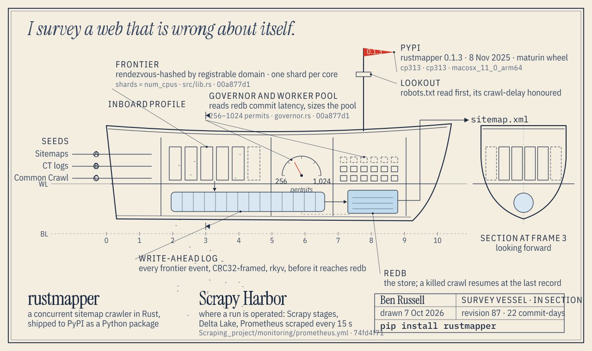
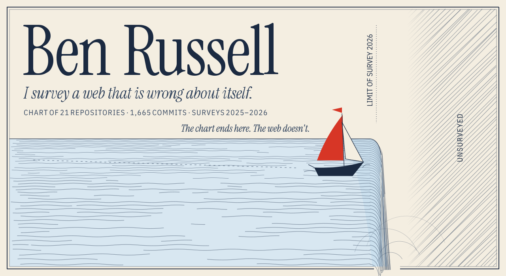
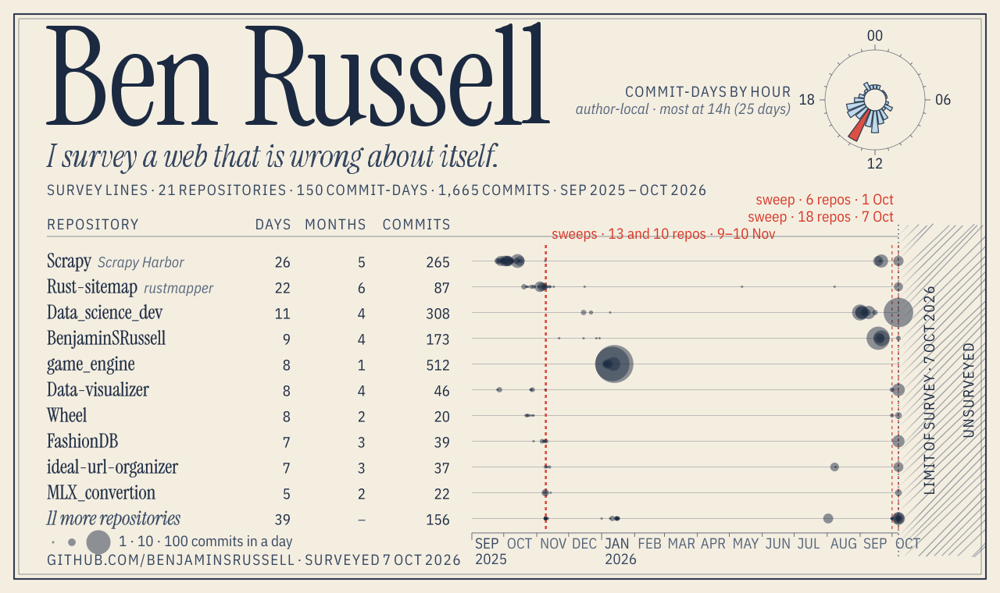

# Three concept stills (round 4, decision D9)

Three bets from different premises, built alongside round 4 for the owner to compare on github.com against
the current hero. Each is one hand-composed day-edition SVG, 1280 wide, no animation, drawn by a small
script in `scripts/concepts/` that reads `assets/stats.json` and `chart.toml` for every figure it prints. Nothing on
them is invented: every number traces to the survey of 7 Oct 2026, and a label with a commit sha is a claim
`stats.json` can source. Rebuild with `python3 scripts/concepts/<name>.py`.

The three questions for each, in one line apiece: *Would you screenshot this and send it to someone? What does it say
you do? What do you want to keep looking at?*

## 1. The vessel, in section

**What it says about Ben.** He builds a machine, and he can draw it: a crawler with its parts named and placed the way a
shipyard draws a hull, so a stranger learns in five seconds that this is systems work in Rust with a Python package on PyPI,
and in a minute how the thing is put together (seeds from sitemaps, CT logs and Common Crawl; a frontier rendezvous-hashed
by registrable domain with one shard per core; a governor that watches the database, not the network; a CRC32-framed
write-ahead log before redb; robots.txt read first). Every figure on the drawing is a claim with a source file and a commit
sha, so the drawing is its own bibliography. Scrapy Harbor is the second name, with the one claim that belongs to it.
Commit history appears once, as the revision in the title block.

**Nightly data.** (1) The edition on the pennant and in the PyPI label: version, release date, wheel tag. (2) The title
block: the date drawn and the revision, which is rustmapper's commit count and commit-days. (3) The three sha-cited
claims (permits from `governor.rs`, shards from `lib.rs`, Scrapy's Prometheus scrape interval), re-read from the source
each night so a changed figure changes on the sheet.

## 2. The waterfall

**What it says about Ben.** One picture: a surveyor at the edge of the charted world, sailing toward the part of the web
nobody has mapped, with the thesis as the caption. It is the avatar's image made the page, a mood rather than a diagram,
and it bets that one strong picture beats six correct ones. It says he is a crawler builder with a point of view about
the web (it is wrong about itself, and he goes to look) and that he cares how things look. The only figures are the title
block's; the picture is the same every night and does not pretend otherwise.

**Nightly data.** (1) The repository count. (2) The commit count. (3) The survey years, first commit to the date of the
survey. Nothing else moves, by design.

## 3. The survey lines

**What it says about Ben.** Two long dense rows at the top (Scrapy, rustmapper) and a cluster of short ones, which is the
truth of the account: two systems worked on across a year, a burst of smaller things in November and January, a game
engine's eight days in January, housekeeping sweeps on 9–10 Nov and 7 Oct that touch everything at once. It is the
information designer's version of the chart: nothing to decode, every date and count readable, the sweeps marked so a
column of dots is not mistaken for work, the hatched margin right of today meaning exactly what it says. The rose is
justified here because hours are cyclic. It says he measures honestly, including about himself.

**Nightly data.** (1) The dots: every commit-day of every repository, sized by commits that day, and the row order and
the three figures beside each name (commit-days, months, commits). (2) The sweep lines with their repo counts and the
limit of survey at today's date. (3) The rose: commit-days by hour of the day in the author's local time, with the busiest
hour named.

## 4. The current hero, for comparison

The v9.2 hero still, day edition, as published on the `chart` branch. The reviews in `docs/crit/round4/` are about this sheet.
